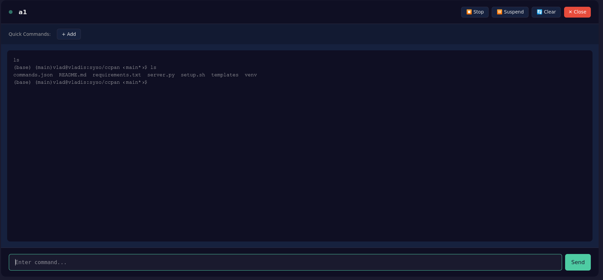

# Tmux Control Panel

A local web-based control panel for running and managing multiple long-running shell or Docker workloads in parallel. Each workload runs in its own real interactive shell backed by a dedicated tmux session.




## Features

- **Multiple Sessions** - Run multiple workloads in parallel, each in its own tab
- **Real TTY** - Each session is a real tmux session with full PTY support
- **Live Output** - Terminal output refreshes every 500ms
- **Quick Commands** - Add custom command buttons per session (server-side storage)
- **Signal Control** - Send Ctrl+C, Ctrl+Z signals to running processes
- **Persistent** - Sessions survive browser refresh and server restart
- **Inspectable** - Attach directly to any session via tmux

## Architecture

```
┌─────────────────────────────────────────────────────────────────────┐
│                         BROWSER (localhost:5000)                     │
│                                                                      │
│   ┌─────────┐ ┌─────────┐ ┌─────────┐                               │
│   │  Tab 1  │ │  Tab 2  │ │  Tab 3  │    ← One tab per session      │
│   └─────────┘ └─────────┘ └─────────┘                               │
│                                                                      │
│   [Terminal Output] [Quick Commands] [Signal Buttons]               │
└─────────────────────────────────────────────────────────────────────┘
                              │
                              │ HTTP/JSON API (polling)
                              ▼
┌─────────────────────────────────────────────────────────────────────┐
│                    FLASK SERVER (Python)                             │
│                                                                      │
│   • Creates/destroys tmux sessions                                  │
│   • Sends keystrokes to sessions                                    │
│   • Captures session output                                         │
│   • Stores custom commands (commands.json)                          │
└─────────────────────────────────────────────────────────────────────┘
                              │
                              │ tmux CLI commands
                              ▼
┌─────────────────────────────────────────────────────────────────────┐
│                    TMUX SERVER (socket: control-panel)               │
│                                                                      │
│   ┌──────────────┐  ┌──────────────┐  ┌──────────────┐              │
│   │ cp-session1  │  │ cp-session2  │  │ cp-session3  │              │
│   │              │  │              │  │              │              │
│   │  [bash/PTY]  │  │  [npm/PTY]   │  │ [python/PTY] │              │
│   │              │  │              │  │              │              │
│   │ [scrollback] │  │ [scrollback] │  │ [scrollback] │              │
│   └──────────────┘  └──────────────┘  └──────────────┘              │
│                                                                      │
│   tmux manages: process lifetime, TTY, scrollback, isolation        │
└─────────────────────────────────────────────────────────────────────┘
```

## How It Works

1. **tmux owns the sessions** - Each tab corresponds to a tmux session with a real PTY
2. **Flask is a bridge** - The server translates HTTP requests to tmux commands
3. **Browser is a viewer** - The UI polls for output and sends user input
4. **No direct execution** - Commands are sent as keystrokes to tmux, not executed directly

### Key Design Principles

- All state lives in tmux, not in the UI
- Sessions persist even if the browser disconnects
- Full terminal programs (vim, htop, etc.) work correctly
- Each session is isolated from others
- Everything is inspectable via standard tmux commands

## Prerequisites

Ubuntu 22.04 (or similar Linux):

```bash
sudo apt update
sudo apt install -y tmux python3 python3-venv python3-pip
```

## Quick Setup

```bash
# Clone or download the project
cd tmux-control-panel

# Create virtual environment
python3 -m venv venv
source venv/bin/activate

# Install dependencies
pip install --upgrade pip
pip install -r requirements.txt

# Run the server
python server.py
```

Open **http://127.0.0.1:5000** in your browser.

Or use the setup script:

```bash
chmod +x setup.sh
./setup.sh
```

## Project Structure

```
tmux-control-panel/
├── server.py           # Flask backend
├── requirements.txt    # Python dependencies
├── setup.sh            # Quick setup script
├── commands.json       # Custom commands storage (auto-created)
├── README.md
├── venv/               # Virtual environment
└── templates/
    └── index.html      # Web UI
```

## Usage

### Creating Sessions

1. Click **"+ New Session"**
2. Enter a session name (e.g., "dev-server")
3. Optionally set a working directory
4. Optionally set an initial command to run
5. Click **"Create"**

### Running Commands

- **Command Input**: Type in the input box and press Enter
- **Quick Commands**: Click custom command buttons
- **Built-in Buttons**:
  - ⏹ Stop - Sends Ctrl+C (SIGINT)
  - ⏸ Suspend - Sends Ctrl+Z (SIGSTOP)
  - 🔄 Clear - Runs `clear` command

### Custom Quick Commands

1. Click **"+ Add"** in the Quick Commands bar
2. Enter a button label and the command
3. Commands are stored on the server in `commands.json`
4. Click the **×** button next to a command to delete it

Quick commands persist across:
- Browser refresh ✅
- Server restart ✅
- Different browsers ✅
- Different devices (same server) ✅

### Keyboard Shortcuts

- **Ctrl+T** - Open new session modal
- **Escape** - Close any open modal
- **Enter** - Send command (when input is focused)

## Direct tmux Access

Sessions are real tmux sessions. You can attach directly for debugging or advanced use:

```bash
# List all control panel sessions
tmux -L control-panel list-sessions

# Attach to a session
tmux -L control-panel attach -t cp-SESSION_NAME

# Detach from session: Ctrl+B, then D

# Kill a session manually
tmux -L control-panel kill-session -t cp-SESSION_NAME
```

## API Reference

### Sessions

| Endpoint | Method | Description |
|----------|--------|-------------|
| `/api/sessions` | GET | List all sessions |
| `/api/sessions` | POST | Create new session |
| `/api/sessions/<name>` | DELETE | Destroy session |
| `/api/sessions/<name>/output` | GET | Get terminal output |
| `/api/sessions/<name>/send` | POST | Send keystrokes |
| `/api/sessions/<name>/signal` | POST | Send signal (INT, STOP, etc.) |
| `/api/sessions/<name>/command` | POST | Run a command |

### Custom Commands

| Endpoint | Method | Description |
|----------|--------|-------------|
| `/api/commands` | GET | Get all custom commands |
| `/api/commands/<session>` | GET | Get commands for a session |
| `/api/commands/<session>` | POST | Add a command |
| `/api/commands/<session>/<index>` | DELETE | Delete a command |

### Other

| Endpoint | Method | Description |
|----------|--------|-------------|
| `/api/health` | GET | Health check |
| `/api/sessions/<name>/debug` | GET | Debug capture output |

### Example API Usage

```bash
# Create a session
curl -X POST http://127.0.0.1:5000/api/sessions \
  -H "Content-Type: application/json" \
  -d '{"name": "myapp", "initial_command": "npm run dev"}'

# Send a command
curl -X POST http://127.0.0.1:5000/api/sessions/cp-myapp/send \
  -H "Content-Type: application/json" \
  -d '{"keys": "echo hello", "enter": true}'

# Get output
curl http://127.0.0.1:5000/api/sessions/cp-myapp/output

# Send Ctrl+C
curl -X POST http://127.0.0.1:5000/api/sessions/cp-myapp/signal \
  -H "Content-Type: application/json" \
  -d '{"signal": "INT"}'

# Add a quick command
curl -X POST http://127.0.0.1:5000/api/commands/cp-myapp \
  -H "Content-Type: application/json" \
  -d '{"label": "Build", "command": "npm run build"}'
```

## Running as a Systemd Service

Create `/etc/systemd/system/tmux-control-panel.service`:

```ini
[Unit]
Description=Tmux Control Panel
After=network.target

[Service]
Type=simple
User=YOUR_USERNAME
WorkingDirectory=/home/YOUR_USERNAME/tmux-control-panel
Environment="PATH=/home/YOUR_USERNAME/tmux-control-panel/venv/bin"
ExecStart=/home/YOUR_USERNAME/tmux-control-panel/venv/bin/python server.py
Restart=always
RestartSec=3

[Install]
WantedBy=multi-user.target
```

Enable and start:

```bash
sudo systemctl daemon-reload
sudo systemctl enable tmux-control-panel
sudo systemctl start tmux-control-panel
sudo systemctl status tmux-control-panel
```

## Configuration

Edit these variables at the top of `server.py`:

```python
TMUX_SOCKET = "control-panel"  # tmux socket name (isolates from your other sessions)
SCROLLBACK_LINES = 2000        # Lines of history to capture
SESSION_PREFIX = "cp-"         # Prefix for managed sessions
COMMANDS_FILE = "commands.json" # Custom commands storage file
```

## Troubleshooting

### "tmux: command not found"
```bash
sudo apt install tmux
```

### Sessions not showing in UI
```bash
# Check if tmux server is running
tmux -L control-panel list-sessions

# Check server logs
python server.py --debug
```

### Output not updating
```bash
# Test capture manually
tmux -L control-panel capture-pane -t cp-SESSION -p -S - -E -
```

### Port already in use
```bash
# Use a different port
python server.py --port 5001

# Or find and kill the process
lsof -i :5000
kill <PID>
```

### Commands not saving
- Check that `commands.json` is writable
- Check server logs for errors

## Security Notes

⚠️ **Important Security Considerations:**

- The server binds to `127.0.0.1` by default (localhost only)
- **Do NOT expose to public networks without authentication**
- Sessions run with the same permissions as the server process
- Anyone with access to the UI can run arbitrary commands
- Consider using a reverse proxy with authentication for remote access

